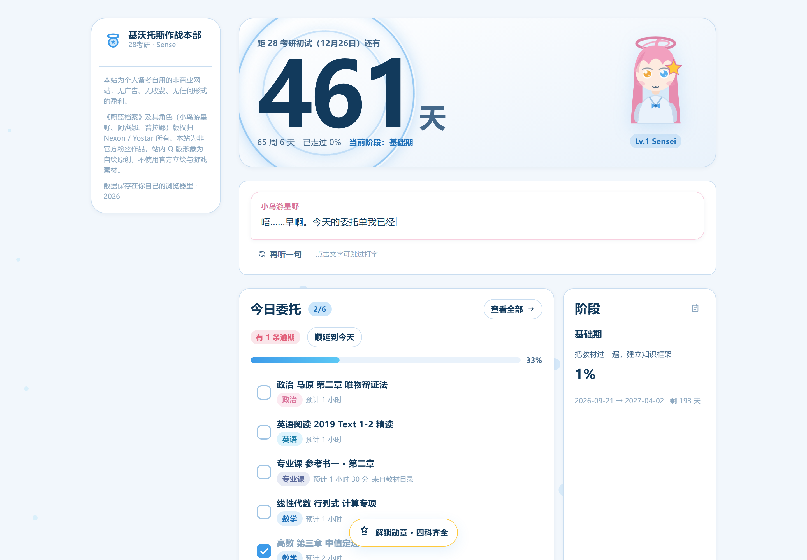
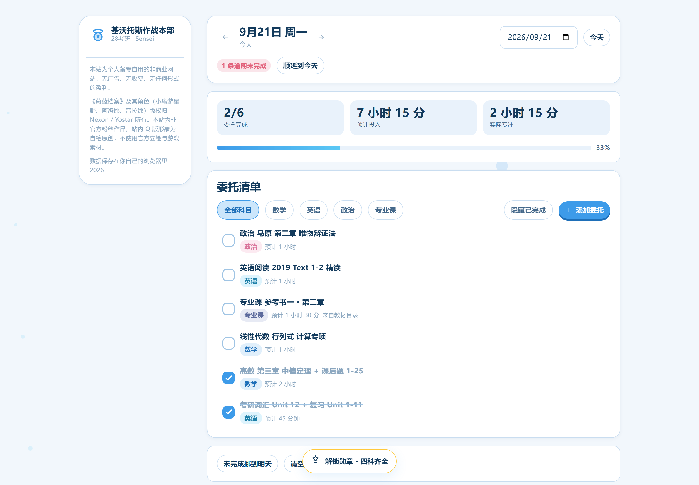
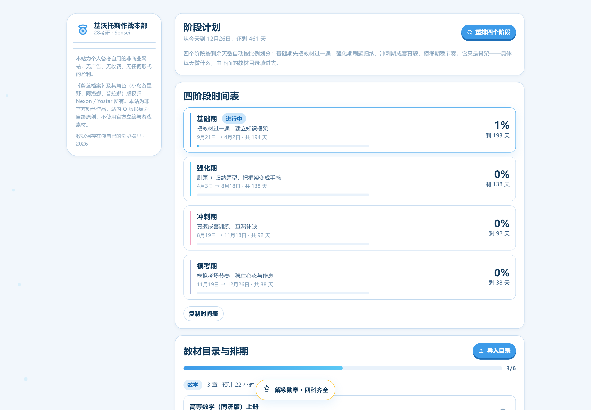
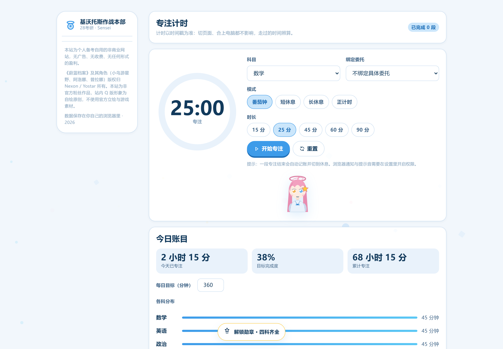
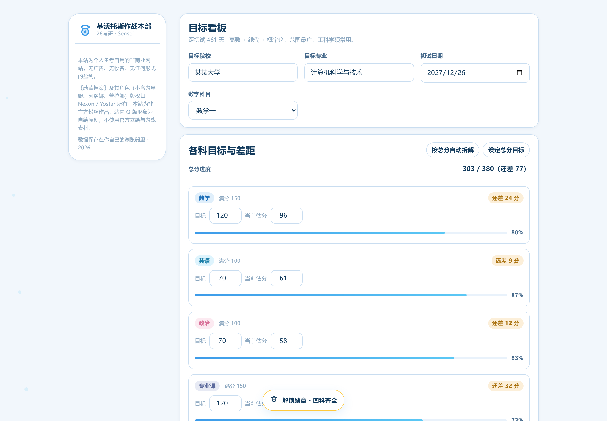
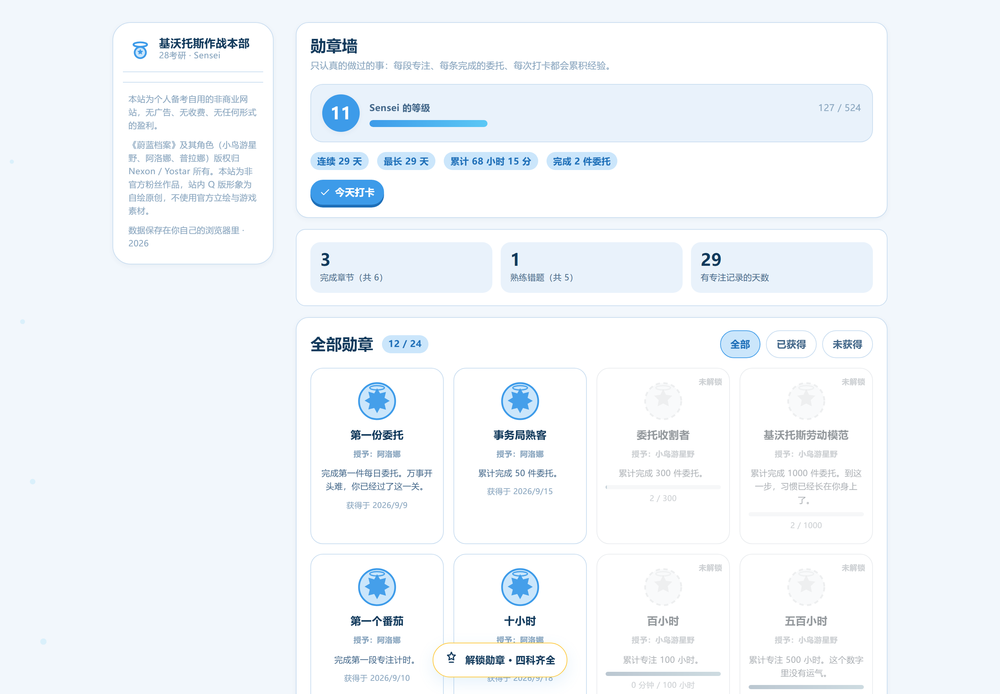
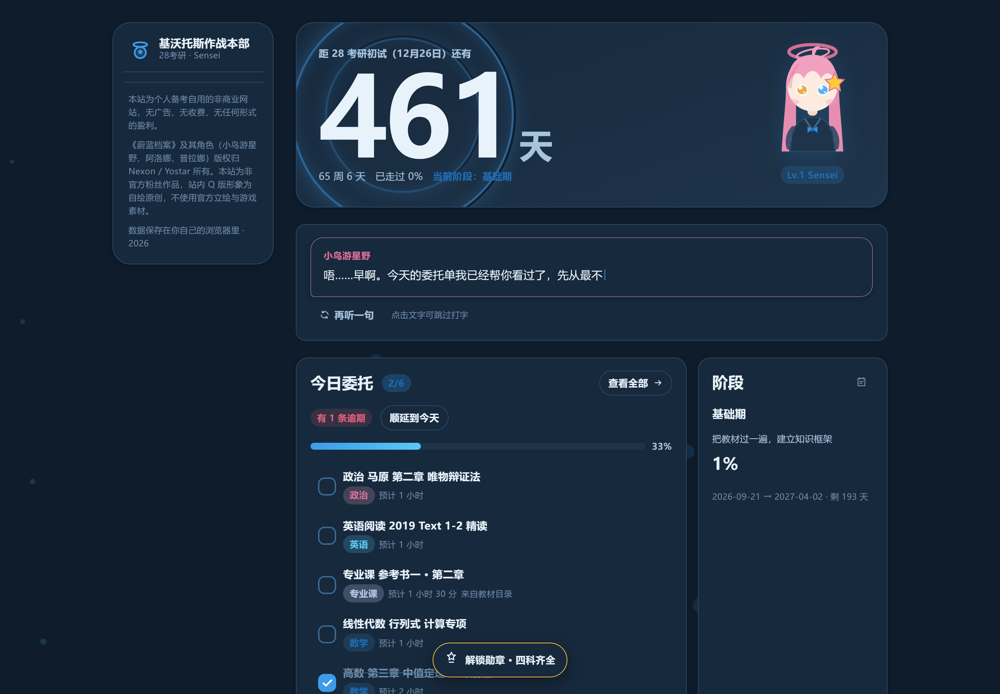
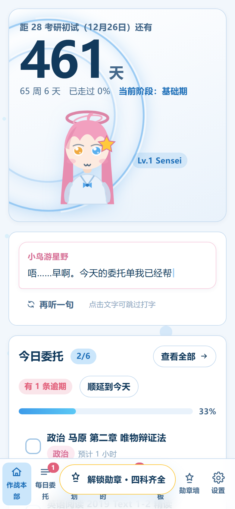

# 基沃托斯作战本部 · 28考研规划站

一个蔚蓝档案（Blue Archive）风格的**个人考研规划网站**。纯静态、零后端、零费用，
电脑 / 平板 / 手机都能用，数据保存在你自己的浏览器里。

> **非商业声明**：本站为个人备考自用，无广告、无收费、无任何形式的盈利。
> 《蔚蓝档案》及其角色（小鸟游星野、阿洛娜、普拉娜）版权归 Nexon / Yostar 所有。
> 站内 Q 版形象是**本项目自绘的原创图形**，不使用官方立绘与游戏内素材，本站为非官方粉丝作品。

---

## 这个站能干什么

| 页面 | 作用 |
|------|------|
| **作战本部**（首页） | 28考研倒计时（含光环）、今日委托单、今日专注、阶段进度、目标差距、星野每天说一句话 |
| **每日委托** | 按天管理任务：勾选、增删改、逾期顺延、未完成挪到明天、按科目筛选 |
| **阶段计划** | 一键生成「基础 / 强化 / 冲刺 / 模考」四段时间表；**导入教材目录 → 自动排进每天**；可选 AI 估算章节时长 |
| **专注计时** | 番茄钟（15/25/45/60/90 分钟）+ 正计时；以时间戳计时，切页面、合电脑都不漂移；近半年热力图 |
| **错题本** | 记错题与薄弱知识点，标掌握程度，按 1 天 → 3 天 → 7 天的间隔提醒复习 |
| **目标看板** | 目标院校 + 各科目标分拆解、当前估分与差距、历年分数线参考 |
| **勋章墙** | 24 枚蔚蓝档案风格勋章 + 等级经验，连续打卡、累计时长、完成委托数触发 |
| **设置** | 考试日期、科目组合、深浅色主题、角色挂件开关、AI 接口、数据导出导入与跨设备迁移 |

---

## 界面预览

| 作战本部（首页） | 每日委托 |
|---|---|
|  |  |

| 阶段计划 | 专注计时 |
|---|---|
|  |  |

| 目标看板 | 勋章墙 |
|---|---|
|  |  |

| 深色模式 | 手机端 |
|---|---|
|  |  |

> 这些图是 `npm run smoke` 自动跑出来的，电脑 / 平板 / 手机三种宽度都验证过，没有横向溢出。

**几个做得比较用心的地方**

- 倒计时数字背后是缓慢转动的**光环**（全站唯一的常驻装饰）。
- 每天打开首页，**星野会跟你说一句不同的话**——她会根据你今天做了多少、落了没落进度换语气，
  不是励志海报腔，也不是客服口吻。
- 每日任务叫**「委托」**，因为这就是基沃托斯事务局发下来的东西。
- 勾选委托有弹跳反馈，解锁勋章会撒一把光点。
- 键盘快捷键：数字 `1`–`8` 切页面，`Ctrl/⌘ + K` 打开命令面板。

---

## 给完全没做过网站的你：三步上线

> 已经帮你把本地仓库建好、代码也提交过了。你只需要：**建仓库 → 跑一个脚本 → 开 Pages**。

### 第 0 步：先在自己电脑上看一眼（可选，但推荐）

需要先装 [Node.js](https://nodejs.org/)（选 LTS 版本，一路下一步即可）。

在这个文件夹里打开终端（在文件夹地址栏输入 `cmd` 回车也行），依次运行：

```bash
npm install     # 第一次运行，装依赖，只需一次
npm run dev     # 启动本地预览
```

终端会给出一个地址（通常是 `http://127.0.0.1:5173`），用浏览器打开就能看到网站。
改代码会自动刷新。按 `Ctrl + C` 停止。

---

### 第 1 步：在 GitHub 上创建空仓库

1. 登录 [github.com](https://github.com)，打开 <https://github.com/new>
2. **Repository name** 填 `kivotos-kaoyan`
3. 选 **Public**（Pages 免费版需要公开仓库）
4. **不要**勾选 "Add a README file"、".gitignore"、"license"（勾了会和本地代码冲突）
5. 点 **Create repository**

---

### 第 2 步：跑上线脚本

**最简单的方式**：直接双击项目根目录的 **`一键上线.bat`**，按提示输入你的 GitHub 用户名即可。

或者在文件夹里打开 PowerShell（地址栏输入 `powershell` 回车），运行：

```powershell
powershell -ExecutionPolicy Bypass -File .\scripts\deploy.ps1 -Username 你的GitHub用户名
```

脚本会自动：检查环境 → 跑一次构建自检（构建失败就不推，避免上线坏站点）→ 提交改动 → 推送。

**第一次推送会弹出浏览器让你登录 GitHub**——这是 GitHub 的安全要求，任何工具都代替不了。
点一次授权，以后推送就不用再登录了。

> ### ⚠️ 必须先打开你的代理软件
>
> 这台机器**不能直连 github.com**（会被重置连接）。脚本会自动读取 Windows 的系统代理设置
> 并让 git 走代理，所以只要**代理软件（Clash / v2ray 等）开着**就行。
>
> 如果推送报 `Connection was reset` 或 `Failed to connect to github.com`，
> 99% 是代理软件没开——打开它，再跑一次脚本。
>
> 另外，项目里已经预置了 `http.proxy=http://127.0.0.1:7897`（只作用于这一个仓库，
> 不影响其他项目）。如果你的代理端口不是 7897，改一下即可：
>
> ```powershell
> git config --local http.proxy http://127.0.0.1:你的端口
> git config --local https.proxy http://127.0.0.1:你的端口
> ```

> **关于 GitHub Desktop**：它也能用（`文件 → Add local repository` 选中这个文件夹 → Publish），
> 但同样需要浏览器登录一次，而且本机安装它需要你点一次管理员权限确认。
> 用上面的脚本更省事。

---

### 第 3 步：打开 GitHub Pages

1. 打开 `https://github.com/你的用户名/kivotos-kaoyan/settings/pages`
2. 在 **Build and deployment** 的 **Source** 里选 **GitHub Actions**（不是 "Deploy from a branch"）
3. 打开 `https://github.com/你的用户名/kivotos-kaoyan/actions` 看部署进度，等它变成绿色对勾（约 1 分钟）
4. 你的网站地址：

```
https://你的用户名.github.io/kivotos-kaoyan/
```

**手机、平板、电脑打开这个网址都能用。** 建议在手机浏览器里「添加到主屏幕」，用起来就像个 App。

> **以后想更新内容**：改完代码，再双击一次 `一键上线.bat`（或跑一次脚本）就行，
> GitHub 会自动重新构建并部署，约 1 分钟后刷新页面就能看到。

> **把项目拷到别的电脑上怎么办**：`node_modules/` 没有进版本库（体积太大也没必要），
> 所以新电脑上先跑 `npm install`，再跑上线脚本即可。其余文件全都在仓库里。

---

### 部署到别的地方（可选）

| 平台 | 怎么做 | 说明 |
|------|--------|------|
| **Vercel / Netlify** | 注册后把仓库连上去，构建命令 `npm run build`，输出目录 `dist` | 也免费，国内访问一般 |
| **Cloudflare Pages** | 同上 | 国内访问相对快 |
| **不用部署** | 运行 `npm run build`，把生成的 `dist` 文件夹双击 `index.html` | 完全离线可用，但换设备要手动拷 |

---

## 怎么改成你自己的

站点**不需要改代码**就能配置的部分，都在「设置」页面里：

- 初试日期、称呼、站点名称、目标院校、数学科目（数一/数二/数三/不考数学）、每日目标时长
- 深浅色主题、三个角色挂件显示/隐藏、星野台词开关
- AI 接口（可选）

### 想换成你自己的 Q 版形象

把图片放进 `public/characters/`，命名为 `hoshino.png` / `arona.png` / `plana.png`，
重新构建即可自动替换。详见 `public/characters/README.md`。

### 想改文案（星野的台词）

编辑 `src/data/dialogues.js`。里面的台词按场景分组：

- `greeting` 日常问候 · `allDone` 今天全做完了 · `idle` 今天还没开始
- `behind` 进度落后 · `focusing` 专注中 · `finalStretch` 最后冲刺

加一句就多一句，系统会按日期自动轮换，同一天刷新也是同一句。

### 想改配色

所有颜色都是 `src/styles/main.css` 顶部的 CSS 变量（`--accent`、`--hoshino`、`--arona`、`--plana` 等），
改一处全站生效。完整的设计规范见 `DESIGN.md`，产品需求见 `PRD.md`。

### 想改章节时长 / 默认教材目录

编辑 `src/data/syllabus.js` 里的 `DEFAULT_OUTLINE`。
不过更简单的做法是：在「阶段计划 → 导入目录」里直接**粘贴你自己的教材目录**，一行一章：

```
第一章 函数与极限 | 8
第二章 导数与微分, 6h
- 第三章 微分中值定理（8 小时）
```

时长可以省略，省略时按每章 2 小时算。

---

## 关于 AI 接口（可选）

「阶段计划 → 导入目录 → 让 AI 估算时长」可以调用你自己的大模型接口，让模型按章节难度重排时长、
标出高频考点、给里程碑。

- 填**任意 OpenAI 兼容接口**：接口地址（到 `/v1` 即可）+ 模型名 + API Key。
- 请求直接从你的浏览器发往你填的地址，**不经过任何第三方**；Key 存在你自己的浏览器里。
- 接口需要允许浏览器跨域（CORS）。如果报跨域错误，说明该服务不允许网页直接调用。
- **不配置也完全能用**：内置的规则排期会把目录按剩余天数均摊到每天。

---

## 数据与备份

- 所有数据存在**你自己浏览器的 localStorage** 里，键名 `kivotos-kaoyan-v1`。
- 清理浏览器数据会一并清掉 → **请定期去「设置 → 数据与迁移 → 导出备份」存一份 JSON**。
- 换设备：在「跨设备同步」里复制本机数据，粘到另一台设备导入即可。
- 没有账号系统，网站上不收集任何个人信息。

---

## 开发者部分

```bash
npm run dev        # 开发服务器（热更新）
npm run build      # 构建到 dist/
npm run preview    # 预览构建产物（http://127.0.0.1:4173）
npm run smoke      # 自动截图 + 检查控制台错误与横向溢出（需先跑 preview）
```

**技术栈**：Vite + 原生 JavaScript ES Modules + 原生 CSS。
打包产物零第三方运行时依赖，gzip 后约 41 KB。

```
src/
├── main.js                 入口：外壳、导航、路由、勋章结算、快捷键
├── styles/main.css         全部样式（Token 来自 DESIGN.md）
├── lib/
│   ├── utils.js            日期 / 格式化 / DOM 构建器 / 随机
│   ├── store.js            数据层：单一 state + localStorage + 订阅
│   ├── focus.js            番茄钟引擎（以时间戳计时，切页面不中断）
│   └── ai.js              可选的 OpenAI 兼容接口调用
├── data/
│   ├── dialogues.js        星野 / 阿洛娜 / 普拉娜的台词
│   ├── medals.js           24 枚勋章的定义与判定
│   └── syllabus.js         教材目录模板、目录解析、分数线参考
├── components/
│   ├── icons.js            内联 SVG 图标（不引图标库）
│   ├── characters.js       自绘 Q 版角色 SVG + 挂件
│   ├── ui.js               Toast / 弹窗 / 打字机 / 滚动 reveal
│   └── footer.js           声明与页脚
└── views/                  8 个页面视图
```

**文档**：`DESIGN.md`（设计规范，9 章节）· `PRD.md`（产品需求与验收标准）

---

## 常见问题

**Q：手机上数据会丢吗？**
A：数据存在浏览器里，只要不清缓存就一直在。换手机或清缓存前，先去设置里导出备份。

**Q：倒计时日期不对？**
A：默认按 2028 级考研初试在 **2027 年 12 月 26 日** 估算。实际日期以教育部当年通知为准，
在「设置 → 考试与个人信息 → 初试日期」里改成准确日期即可。

**Q：部署后打开是白屏？**
A：检查仓库 **Settings → Pages → Source** 是否选了 **GitHub Actions**，
以及 **Actions** 里的部署任务是否成功（绿色对勾）。

**Q：想同时用电脑和手机，数据能自动同步吗？**
A：没有服务器，所以做不到实时自动同步。用「设置 → 跨设备同步」手动导出导入，
一分钟搞定。这是为了"零成本、零隐私风险"付出的代价。

**Q：能不能加个后端做真正的云同步？**
A：可以，但那就需要服务器和账号系统了。现阶段建议先用导出导入顶着。
