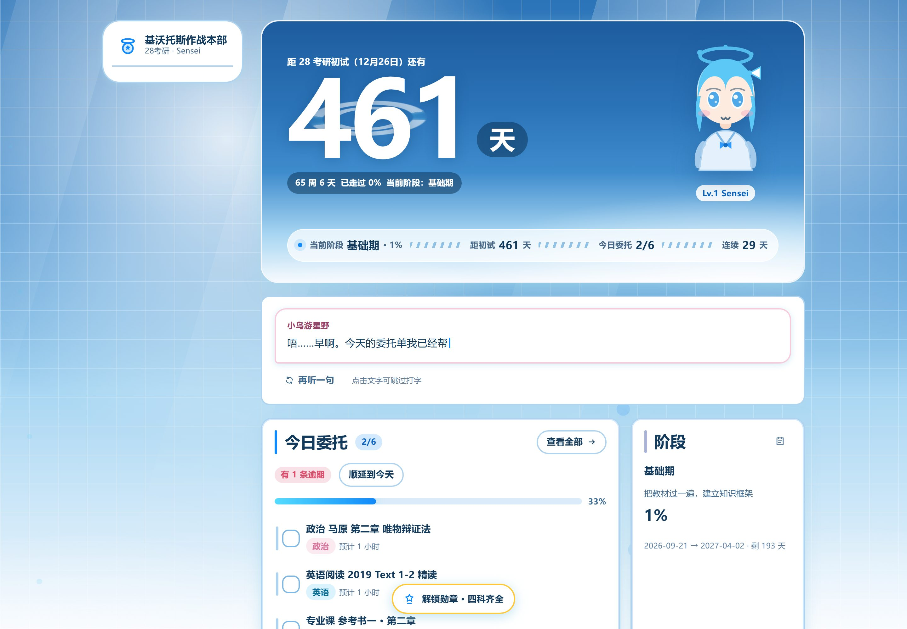
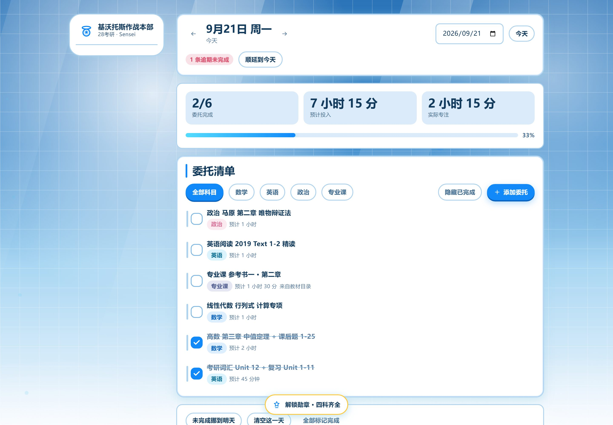
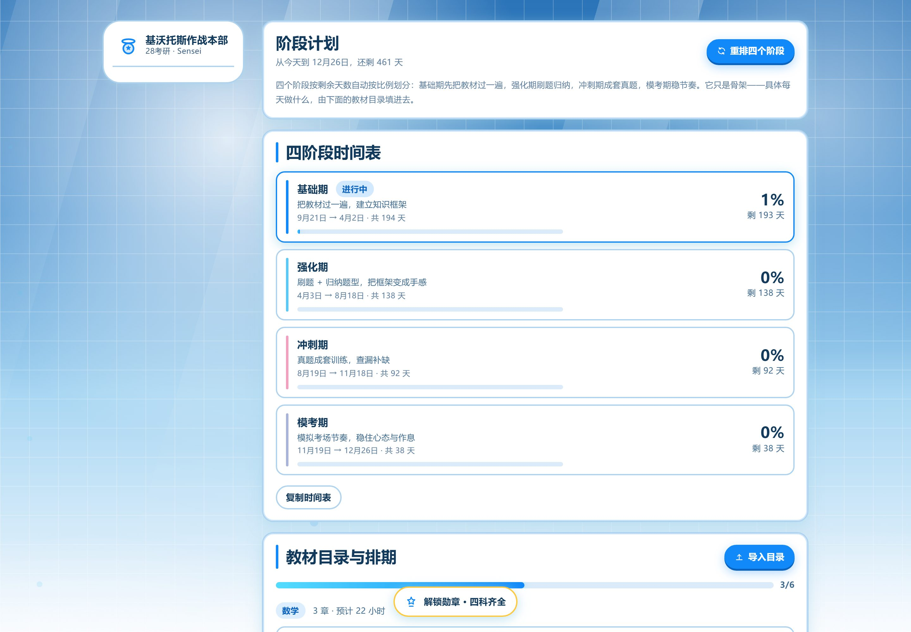
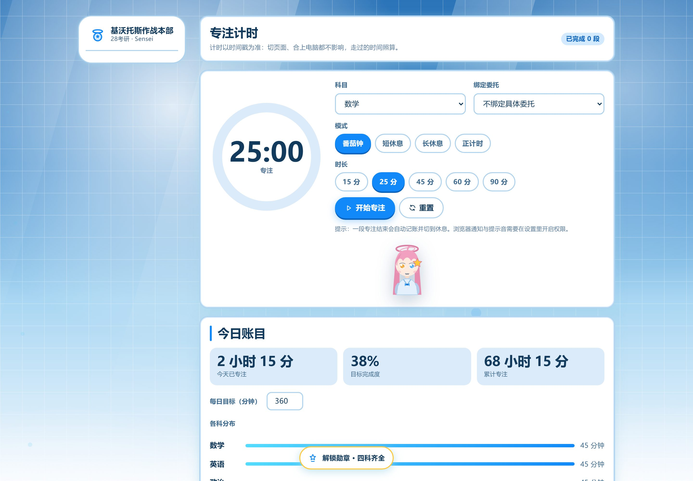
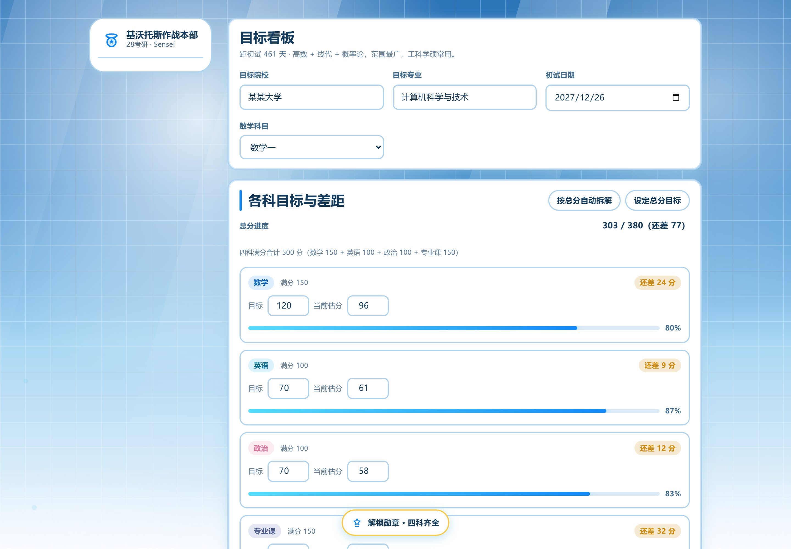
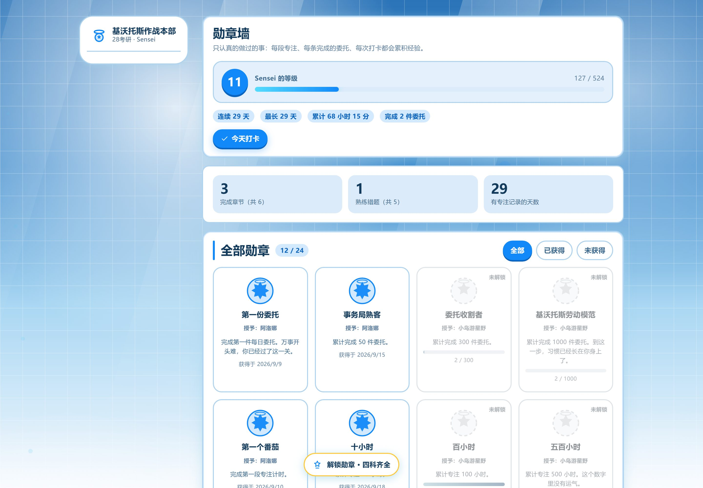
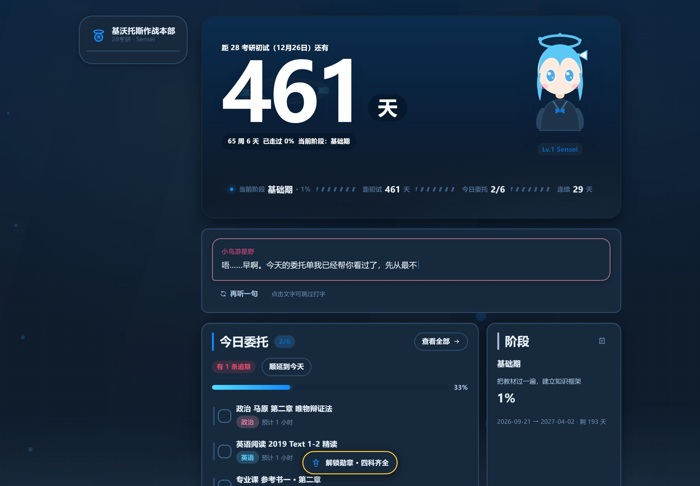
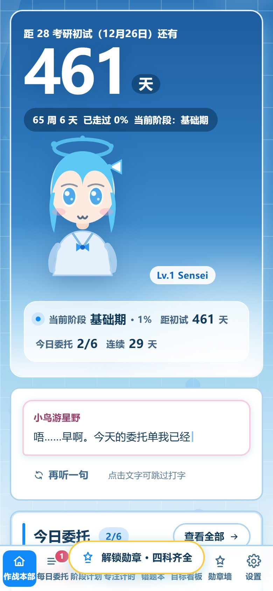

# 基沃托斯作战本部 · 28考研规划站

一个蔚蓝档案（Blue Archive）风格的**个人考研规划网站**。电脑 / 平板 / 手机都能用，
数据默认保存在你自己的浏览器里；**可选**接入 Supabase 后端做真正的账号登录与跨设备云同步。

> **两条路线，先看清楚再动手：**
>
> | | 不配后端（默认） | 配上 Supabase 后端 |
> |---|---|---|
> | 数据存在哪 | 你自己的浏览器（localStorage） | 你自己的浏览器 + 你自己的 Supabase 项目 |
> | 换设备 | 导出 JSON → 导入 | 登录同一个邮箱就自动同步 |
> | 多个人用 | 各自浏览器天然隔离 | 各自注册，数据库行级安全强隔离 |
> | 费用 | 0 | 0（Supabase 免费额度） |
> | 要不要做 | 什么都不用做，打开就能用 | 见下面「用 Supabase 做真正的后端」 |
>
> 两种可以共存：**没配置后端时，全站一行网络请求都不会发**（Supabase 的 SDK 是按需加载的，
> 没配的人根本不会下载它）。

## 🌐 线上地址

**<https://luoyuwushen.github.io/kivotos-kaoyan/>**

> **部署方式**：`main` 分支放源码，构建好的成品放在 `gh-pages` 分支。
> 仓库 Settings → Pages → Source 选 **Deploy from a branch → `gh-pages` / (root)**。
> 更新内容：改完代码双击 `一键上线.bat`，它会自动构建并同步 `gh-pages`。
> （仓库里另有一条 `.github/workflows/deploy.yml` 的 GitHub Actions 路线，二选一，别同时开。）
>
> 推送成功后 GitHub Pages 要重建，**线上不是立刻变的**，通常 1～10 分钟；
> 这期间线上仍是上一版，属正常现象。
>
> ⚠️ **上线护栏**：如果项目根目录存在配了 Supabase 的 `.env.local`，`deploy.ps1` 会**拒绝构建**
> 并告诉你原因 —— 因为 GitHub Pages 是公开的，把某个项目的 URL + anon key 编进发布包之后，
> 所有访客打开站点都会被指向那个项目。只有「自己一个人用、就想打开即配好」时才加
> `-BakeSupabaseConfig` 绕过它。

> **非商业声明**：本站为个人备考自用，无广告、无收费、无任何形式的盈利。
> 《蔚蓝档案》及其角色（小鸟游星野、阿洛娜、普拉娜）版权归 Nexon / Yostar 所有。
> 站内 Q 版形象是**本项目自绘的原创图形**，不使用官方立绘与游戏内素材，本站为非官方粉丝作品。

---

## 这个站能干什么

| 页面 | 作用 |
|------|------|
| **作战本部**（首页） | 28考研倒计时（含光环）、今日委托单、今日专注、阶段进度、目标差距、星野每天说一句话 |
| **每日委托** | 按天管理任务：勾选、增删改、逾期顺延、未完成挪到明天、按科目筛选 |
| **阶段计划** | 一键生成「基础 / 强化 / 冲刺 / 模考」四段时间表；**导入教材目录 → 自动排进每天**；可选 AI 估算章节时长 |
| **专注计时** | 番茄钟（15/25/45/60/90 分钟）+ 正计时；以时间戳计时，切页面、合电脑都不漂移；近半年热力图 |
| **错题本** | 记错题与薄弱知识点，标掌握程度，按 1 天 → 3 天 → 7 天的间隔提醒复习 |
| **目标看板** | 目标院校 + 各科目标分拆解、当前估分与差距、历年分数线参考 |
| **勋章墙** | 24 枚蔚蓝档案风格勋章 + 等级经验，连续打卡、累计时长、完成委托数触发 |
| **设置** | 考试日期、科目组合、深浅色主题、角色挂件开关、**云端同步（可选后端）**、AI 接口、数据导出导入与跨设备迁移 |

---

## 界面预览

| 作战本部（首页） | 每日委托 |
|---|---|
|  |  |

| 阶段计划 | 专注计时 |
|---|---|
|  |  |

| 目标看板 | 勋章墙 |
|---|---|
|  |  |

| 深色模式 | 手机端 |
|---|---|
|  |  |

> 这些图是 `npm run smoke` 自动跑出来的，电脑 / 平板 / 手机三种宽度都验证过，没有横向溢出。

**几个做得比较用心的地方**

- 倒计时数字背后是缓慢转动的**光环**（全站唯一的常驻装饰）。
- 每天打开首页，**星野会跟你说一句不同的话**——她会根据你今天做了多少、落了没落进度换语气，
  不是励志海报腔，也不是客服口吻。
- 每日任务叫**「委托」**，因为这就是基沃托斯事务局发下来的东西。
- 勾选委托有弹跳反馈，解锁勋章会撒一把光点。
- 键盘快捷键：数字 `1`–`8` 切页面，`Ctrl/⌘ + K` 打开命令面板。

---

## 用 Supabase 做真正的后端（可选，路径 2）

> 这一节是给「想手机和电脑自动同步」或「想让同学各自注册使用」的人看的。
> 不需要的话**整节跳过**，上面所有功能照样能用。

**为什么是 Supabase 而不是自己写一个 Node 服务**

| 对比项 | Supabase | 自己写 Node + 数据库 |
|--------|----------|---------------------|
| 注册登录 | 内置（邮箱魔法链接 / 密码） | 要自己做密码加密、找回密码、邮件 |
| 权限 | **行级安全（RLS）**，在数据库层保证「只能碰自己那一行」 | 每个接口都要自己鉴权，漏一个就泄露 |
| 运维 | 托管，不用管备份扩容 HTTPS | 进程、备份、证书、域名全要自己管 |
| 费用 | 免费额度（500MB 数据库 / 5 万月活）够一个人用很久 | 要自己找免费主机 |

**「不同用户」是怎么区分的**：登录后浏览器拿到一个 JWT，里面带 `user_id`；
每次读写数据库都带这个 JWT，而表上的 RLS 策略只放行 `auth.uid() = user_id` 的那一行。
就算有人改前端 JS 想查别人的数据，**数据库这一层也会拒绝**——安全边界在数据库，不在前端。
（所以 `anon key` 写在前端是设计如此，它不是漏洞；真正不能放前端的是 `service_role` key，
本站会在设置页明确拦下它。）

### 三步开起来

**第 1 步：建项目 + 建表（约 10 分钟）**

> 偷懒做法：双击项目根目录的 **`一键开通后端.bat`**。它会打开建表 SQL、把 SQL 内容
> 复制到剪贴板、并打开 Supabase 控制台，你只要「建项目 → Ctrl+V → Run」三步。

1. 打开 [supabase.com](https://supabase.com) 注册 → **New project**（区域选离你近的）
2. 进 **SQL Editor → New query**，把仓库里 [`docs/supabase-schema.sql`](docs/supabase-schema.sql)
   整段粘进去 → **Run**。看到 `Success. No rows returned` 就成了。
   > 这一步建表 + 打开行级安全 + 装自动时间戳。**不做这步，登录后会提示「还没有 kaoyan_data 表」。**
   >
   > **控制台报 `Failed to get project's logs`？** 那是底部日志面板拉不到日志，不是你的 SQL 失败。
   > 用这两招确认：① 新建查询跑 `select count(*) from pg_policies where tablename='kaoyan_data';`
   > ② 或看左侧 **Table Editor** 里有没有 `kaoyan_data` 表。
   > 建表脚本可以重复执行（`create table if not exists` + 策略先删再建），多跑几次不会坏。
   > 如果 SQL Editor 整条路都不行，还可以绕开它：
   > `node scripts/apply-schema.mjs --db-host db.xxxx.supabase.co --db-pass '数据库密码'`
   > （连 Postgres 直连，建完自动自检表/RLS/策略/触发器）
3. 进 **Authentication → Sign In / Providers → Email**，确认邮箱登录是开着的。
   测试阶段建议顺手关掉 **Confirm email**，省得每次注册都要去点邮件。

**第 2 步：把项目接到站点上（先想清楚「谁来填」）**

这里有个容易踩的坑：**GitHub Pages 的线上构建读不到 `.env.local`**（它不进版本库）。
所以「本地构建带上配置」≠「线上站点也带上配置」。按你的用途选一种：

| | 方式 A：线上站点自己用（**推荐**） | 方式 B：线上站点给多人用 |
|---|---|---|
| 谁填配置 | 构建时就写死了 | 每个使用者在「设置 → 云端同步」里填自己的项目 |
| 怎么做 | 跑 `deploy.ps1 -AskCredentials`，它问你一次地址和 key，写进 `.env.local` 并烘焙进这次构建 | 什么都不用做（现在的线上站点就是这种） |
| 打开站点 | 已经是配好的，直接登录 | 引导使用者填自己的 Project URL + anon key |
| 适合 | 自己一个人用，手机电脑都登录同一个账号 | 把网址发给同学，各自建项目、数据各归各的 |

方式 A 的命令（**注意要带 `-AskCredentials`**，否则脚本会拒绝构建）：

```powershell
powershell -ExecutionPolicy Bypass -File .\scripts\deploy.ps1 -Username 你的GitHub用户名 -AskCredentials
```

> 为什么默认要拦：GitHub Pages 是公开的。一旦把项目地址编进发布包，**所有访客**打开站点
> 都会被指向你的项目；配上后台关闭公开注册，别人就写不进去（能写也只写进他自己那一行，
> 被 RLS 挡着）。即便如此，公开站点带上你的项目地址也不是好默认，所以必须显式加开关。
>
> 只想在**本地**构建带上配置（自己跑 `npm run dev` / `npm run preview`）：
> 跑 `npm run supabase:setup`，它会写 `.env.local` 并立刻跑一遍真机联调。

**第 3 步：登录，选一次同步方向**

第一次连接时，本机和云端各有一份数据，页面会问你**保留哪一边**——
这一步永远问你，不替你决定（被覆盖的那边救不回来）。选完之后：

- 本地改动会在 2～3 秒后自动上传
- 在另一台设备登录后会自动拉取
- 万一两台设备都改了（冲突），会明确提示并让你选，**不会悄悄覆盖**

### 关于安全与隐私（说清楚）

- 数据存在**你自己的** Supabase 项目里，站主看不到；换个人注册就是一份独立数据。
- 行级安全策略在 `docs/supabase-schema.sql` 里，一共 4 条（读/增/改/删各一条），
  可以自己审。表还开了 `force row level security`，连表属主都绕不过策略。
- **建议关掉公开注册**：如果你是自己一个人用（方式 A），到
  **Authentication → Sign In / Providers → Email** 把 **Allow new users to sign up** 关掉。
  这样即使别人拿到你的站点和 anon key，也注册不了账号、更读不到你任何一行数据；
  你自己先用邮箱注册好，之后照常登录。
- 本地数据**不会因为你登录就被删**：云端数据是另一份，导入导出备份随时可用。
- 退出登录、删云端数据都是显式操作，删云端**不影响本机**。

### 常见问题

| 现象 | 原因与处理 |
|------|-----------|
| 登录后提示「还没有 kaoyan_data 表」 | 第 1 步的建表 SQL 没执行，去 SQL Editor 跑一遍 |
| 收不到登录邮件 | 免费额度有发信频率限制，等几分钟；或检查垃圾邮件；或改用「邮箱 + 密码」注册 |
| 邮件里点链接回来没登录上 | 见下面「必须配的三个认证设置」第 3 条（Redirect URLs） |
| 提示「这是 service_role key，绝对不能放在前端」 | 复制错了，要的是 **anon public** 那一行 |
| 项目过一段时间连不上 | 免费版会在一段时间无人访问后休眠，去控制台点一下 Restore，数据不丢 |
| 想清掉某个人留在云端的数据 | 设置 → 云端同步 → **删除云端数据**（只删服务器那一行） |
| 想知道同步为什么没动 | 控制台执行 `localStorage.setItem('kivotos-kaoyan-cloud-debug','1')` 再刷新，会打印同步判定用的时间戳 |

### 必须配的三个认证设置（漏一个就登不上）

都在 **Authentication → Sign In / Providers → Email**，以及 **Authentication → URL Configuration**：

| # | 位置 | 设成什么 | 不设会怎样 |
|---|------|----------|-----------|
| 1 | Sign In / Providers → Email | **Enable email provider** 打开 | 发不出登录邮件 |
| 2 | 同上 → **Confirm email** | 自己用 → **关掉**（注册即登录）；给同学用 → 打开 | 开着时必须先去邮箱点确认，才能用密码登录 |
| 3 | URL Configuration → **Redirect URLs** | 加一条本站地址，例如 `https://luoyuwushen.github.io/kivotos-kaoyan/**` | 魔法链接点回来会跳错地方，登不上 |

> 第 3 条是「点了邮件里的链接、回来却还是未登录」的唯一原因，且只在用**魔法链接**时才会遇到。
> 只想快点跑通，可以先跳过魔法链接，直接用「邮箱 + 密码」注册登录（第 1、2 条仍然要配）。

### ⚠️ 中国大陆网络：浏览器需要能连上 `*.supabase.co`

这条是实测出来的，不是猜的：**从大陆网络直连 `你的项目.supabase.co:443` 会失败** ——
它挂在 Cloudflare 上，直接连接会被重置。所以：

- **用这个网站的人（包括你自己）需要开着代理/VPN**，浏览器才能跟 Supabase 通信。
  没开代理时：本地功能全部照常（数据在 localStorage 里，一分不少），只是**同步不上云**，
  设置页的云端状态会显示同步失败。
- 界面对这件事是安全的：连不上就是失败提示 + 本地数据不动，不会把本地数据弄丢或写坏。
- 想彻底绕开这个限制，只有两条路：给 Supabase 项目绑**自定义域名**，或者换成国内可达的后端。
  在此之前，把代理一直开着是最省事的做法。

> 顺带说一句，命令行验证也要走代理。Node 24 支持这样跑（其他版本请自行配代理）：
>
> ```powershell
> $env:NODE_USE_ENV_PROXY='1'; $env:HTTPS_PROXY='http://127.0.0.1:7897'
> npm run test:cloud:live
> ```

---

## 给完全没做过网站的你：三步上线

> 已经帮你把本地仓库建好、代码也提交过了。你只需要：**建仓库 → 跑一个脚本 → 开 Pages**。

### 第 0 步：先在自己电脑上看一眼（可选，但推荐）

需要先装 [Node.js](https://nodejs.org/)（选 LTS 版本，一路下一步即可）。

在这个文件夹里打开终端（在文件夹地址栏输入 `cmd` 回车也行），依次运行：

```bash
npm install     # 第一次运行，装依赖，只需一次
npm run dev     # 启动本地预览
```

终端会给出一个地址（通常是 `http://127.0.0.1:5173`），用浏览器打开就能看到网站。
改代码会自动刷新。按 `Ctrl + C` 停止。

---

### 第 1 步：在 GitHub 上创建空仓库

1. 登录 [github.com](https://github.com)，打开 <https://github.com/new>
2. **Repository name** 填 `kivotos-kaoyan`
3. 选 **Public**（Pages 免费版需要公开仓库）
4. **不要**勾选 "Add a README file"、".gitignore"、"license"（勾了会和本地代码冲突）
5. 点 **Create repository**

---

### 第 2 步：跑上线脚本

**最简单的方式**：直接双击项目根目录的 **`一键上线.bat`**，按提示输入你的 GitHub 用户名即可。

或者在文件夹里打开 PowerShell（地址栏输入 `powershell` 回车），运行：

```powershell
powershell -ExecutionPolicy Bypass -File .\scripts\deploy.ps1 -Username 你的GitHub用户名
```

脚本会自动：检查环境 → 跑一次构建自检（构建失败就不推，避免上线坏站点）→ 提交改动 → 推送。

**第一次推送会弹出浏览器让你登录 GitHub**——这是 GitHub 的安全要求，任何工具都代替不了。
点一次授权，以后推送就不用再登录了。

> ### ⚠️ 必须先打开你的代理软件
>
> 这台机器**不能直连 github.com**（会被重置连接）。脚本会自动读取 Windows 的系统代理设置
> 并让 git 走代理，所以只要**代理软件（Clash / v2ray 等）开着**就行。
>
> 如果推送报 `Connection was reset` 或 `Failed to connect to github.com`，
> 99% 是代理软件没开——打开它，再跑一次脚本。
>
> 另外，项目里已经预置了 `http.proxy=http://127.0.0.1:7897`（只作用于这一个仓库，
> 不影响其他项目）。如果你的代理端口不是 7897，改一下即可：
>
> ```powershell
> git config --local http.proxy http://127.0.0.1:你的端口
> git config --local https.proxy http://127.0.0.1:你的端口
> ```

> **关于 GitHub Desktop**：它也能用（`文件 → Add local repository` 选中这个文件夹 → Publish），
> 但同样需要浏览器登录一次，而且本机安装它需要你点一次管理员权限确认。
> 用上面的脚本更省事。

---

### 第 3 步：打开 GitHub Pages

1. 打开 `https://github.com/你的用户名/kivotos-kaoyan/settings/pages`
2. 在 **Build and deployment** 的 **Source** 里选 **GitHub Actions**（不是 "Deploy from a branch"）
3. 打开 `https://github.com/你的用户名/kivotos-kaoyan/actions` 看部署进度，等它变成绿色对勾（约 1 分钟）
4. 你的网站地址：

```
https://你的用户名.github.io/kivotos-kaoyan/
```

**手机、平板、电脑打开这个网址都能用。** 建议在手机浏览器里「添加到主屏幕」，用起来就像个 App。

> **以后想更新内容**：改完代码，再双击一次 `一键上线.bat`（或跑一次脚本）就行，
> GitHub 会自动重新构建并部署，约 1 分钟后刷新页面就能看到。

> **把项目拷到别的电脑上怎么办**：`node_modules/` 没有进版本库（体积太大也没必要），
> 所以新电脑上先跑 `npm install`，再跑上线脚本即可。其余文件全都在仓库里。

---

### 部署到别的地方（可选）

| 平台 | 怎么做 | 说明 |
|------|--------|------|
| **Vercel / Netlify** | 注册后把仓库连上去，构建命令 `npm run build`，输出目录 `dist` | 也免费，国内访问一般 |
| **Cloudflare Pages** | 同上 | 国内访问相对快 |
| **不用部署** | 运行 `npm run build`，把生成的 `dist` 文件夹双击 `index.html` | 完全离线可用，但换设备要手动拷 |

---

## 怎么改成你自己的

站点**不需要改代码**就能配置的部分，都在「设置」页面里：

- 初试日期、称呼、站点名称、目标院校、数学科目（数一/数二/数三/不考数学）、每日目标时长
- 深浅色主题、三个角色挂件显示/隐藏、星野台词开关
- AI 接口（可选）

### 想换成你自己的 Q 版形象

把图片放进 `public/characters/`，命名为 `hoshino.png` / `arona.png` / `plana.png`，
重新构建即可自动替换。详见 `public/characters/README.md`。

### 想改文案（星野的台词）

编辑 `src/data/dialogues.js`。里面的台词按场景分组：

- `greeting` 日常问候 · `allDone` 今天全做完了 · `idle` 今天还没开始
- `behind` 进度落后 · `focusing` 专注中 · `finalStretch` 最后冲刺

加一句就多一句，系统会按日期自动轮换，同一天刷新也是同一句。

### 想改配色

所有颜色都是 `src/styles/main.css` 顶部的 CSS 变量（`--accent`、`--hoshino`、`--arona`、`--plana` 等），
改一处全站生效。完整的设计规范见 `DESIGN.md`，产品需求见 `PRD.md`。

### 想改章节时长 / 默认教材目录

编辑 `src/data/syllabus.js` 里的 `DEFAULT_OUTLINE`。
不过更简单的做法是：在「阶段计划 → 导入目录」里直接**粘贴你自己的教材目录**，一行一章：

```
第一章 函数与极限 | 8
第二章 导数与微分, 6h
- 第三章 微分中值定理（8 小时）
```

时长可以省略，省略时按每章 2 小时算。

---

## 关于 AI 接口（可选）

「阶段计划 → 导入目录 → 让 AI 估算时长」可以调用你自己的大模型接口，让模型按章节难度重排时长、
标出高频考点、给里程碑。

- 填**任意 OpenAI 兼容接口**：接口地址（到 `/v1` 即可）+ 模型名 + API Key。
- 请求直接从你的浏览器发往你填的地址，**不经过任何第三方**；Key 存在你自己的浏览器里。
- 接口需要允许浏览器跨域（CORS）。如果报跨域错误，说明该服务不允许网页直接调用。
- **不配置也完全能用**：内置的规则排期会把目录按剩余天数均摊到每天。

---

## 数据与备份

- 数据默认存在**你自己浏览器的 localStorage** 里，键名 `kivotos-kaoyan-v1`。
- 清理浏览器数据会一并清掉 → **请定期去「设置 → 数据与迁移 → 导出备份」存一份 JSON**。
- 换设备：在「跨设备同步」里复制本机数据，粘到另一台设备导入即可（没有后端时用这个）。
- **配了 Supabase 之后**：登录同一个邮箱，另一台设备自动就有；本机那份仍然是完整可用的。

### 关于「不同用户」

**不配后端时靠浏览器隔离，不靠账号**：同一个网址，你用手机打开是你自己的数据，
同学用他的手机打开是一份全新的空数据，互相看不到——因为根本没有服务器，你的记录从未离开设备。

**配了后端（路径 2）之后靠账号 + 行级安全隔离**：每人一个 `user_id`，
数据库层的 RLS 策略保证「只能读写自己那一行」。实现原理、建表 SQL 与常见问题见
**[`docs/后端与多用户方案.md`](docs/后端与多用户方案.md)**，一键配置脚本见 `npm run supabase:setup`。

---

## 设置菜单里都有什么

「设置」是整个站的控制台，不需要改代码就能调整：

| 分组 | 能改什么 |
|------|----------|
| **考试与个人信息** | 称呼、站点名称、**初试日期**（倒计时跟着变）、数学科目（数一/数二/数三/不考数学）、每日目标时长 |
| **外观与角色** | 浅色/深色主题、三个角色挂件显示与隐藏、星野台词开关、**自定义角色图**（用 `characters/` 里的 PNG 替换自绘形象） |
| **AI 接口（可选）** | 是否启用、接口地址、模型名称、API Key；并显示当前是否已就绪 |
| **数据与迁移** | 导出备份（下载 JSON）、导入备份、跨设备同步（复制/粘贴）、清空全部数据 |
| **关于本站** | 用途与版权声明、本地存储键名 |

---

## 分数与满分规则

按考研真实分制，**满分由科目决定，不需要你填**：

| 科目 | 满分 |
|------|------|
| 数学（数一/数二/数三） | 150 |
| 英语 | 100 |
| 政治 | 100 |
| 专业课 | 150 |
| **总分** | **500**（不考数学时为 350） |

目标看板的输入框会按各自满分限制上限；如果老数据里存在被写错的满分
（早期版本曾把英语/政治写成 150 分制），页面上会出现「N 科满分有误」和**一键修正**按钮。

---

## 开发者部分

```bash
npm run dev        # 开发服务器（热更新）
npm run build      # 构建到 dist/
npm run preview    # 预览构建产物（http://127.0.0.1:4173）
npm run smoke      # 自动截图 + 检查控制台错误与横向溢出（需先跑 preview）
npm test           # 42 项交互功能测试（需先跑 preview）
npm run test:scores # 15 项分数满分规则测试（需先跑 preview）
npm run test:cloud  # 49 项云端同步测试：自带一个「假 Supabase」，会真的校验 JWT、
                    # 真的执行 RLS（越权写入返回 403、跨用户查询返回空集）——不用联网、不用花钱
npm run supabase:setup   # 配置你自己的 Supabase 项目（写 .env.local）并立刻跑真机联调
npm run test:cloud:live  # 真机联调：直接打你真实的 Supabase，验证建表 / RLS / 隔离 / 清理
```

**设计相关的三个脚本**（改配色 / 改样式之后建议都跑一遍）：

```bash
node scripts/contrast-audit.mjs  # 对比度审计：天空面板是渐变叠辉光，靠 token 推算一定算错，
                                 # 所以它沿面板取一条无文字的竖条当背景亮度剖面，
                                 # 再按每个文字元素的位置算 WCAG 对比度。
                                 # 现状：新增的云端状态徽标全部 ≥5.1:1；
                                 # 仍有 3 项未达 AA，都是天空面板上的既有问题（见下）。
node scripts/audit-design.mjs    # DESIGN.md 合规：组件里不准出现硬编码颜色，字号要落在层级表内
node scripts/ba-recon.mjs        # 设计调研：用真实浏览器打开官方站，抓 computed style 频次 + 截图
                                 # （产物在 ba-recon/，已 gitignore，仅供重新取材时用）
```

> **已知问题（不是这次改动引入的）**：`contrast-audit.mjs` 会报 3 项未达 AA ——
> 侧栏导航文字与图标 3.52:1、委托条目元信息 4.31:1，都落在天空面板上。
> 在同一份基线代码上跑也是同样 3 项，所以属于既有设计问题；要修得动 `--sky-*` 的渐变深度，
> 或给这两处文字加深色贴片（像 `.strapbar__item strong` 那样），属于视觉决策，这次没有一并改。

**改配色请改 `DESIGN.md` 第 2 节的 token，不要直接在组件里写颜色** —— `audit-design.mjs` 会拦下来。

**上线后验证线上站点**（确认发出去的确实是本地验证过的那套）：

```bash
npm run verify:live         # 运行时：无控制台报错 / 无 404 / 无横向溢出 / 无异常弹窗
npm run verify:live:design  # 设计落地：逐条断言天空面板、2px 边框、三层叠边、压扁光环、
                            # 身份色、深色模式、手机端导航、云端同步卡片等 49 项（当前 49/49 通过）
```

> 运行时不出错 ≠ 样式上对了。上一版就出现过「白字落在浅色天空上、对比度只有 1.35:1」
> 这种不报错、但根本看不清的问题，所以 `verify:live:design` 会把 DESIGN.md 的关键 Token 逐条断言一遍。

**技术栈**：Vite + 原生 JavaScript ES Modules + 原生 CSS。
打包产物主包 gzip 后约 51 KB；Supabase SDK 单独分包（约 60 KB gzip），
**只有真的配置了云端才会下载**——没配后端的人拿到的仍然是那个零第三方依赖的静态站。

```
src/
├── main.js                 入口：外壳、导航、路由、勋章结算、快捷键、启动时对账云端
├── styles/main.css         全部样式（Token 来自 DESIGN.md）
├── lib/
│   ├── utils.js            日期 / 格式化 / DOM 构建器 / 随机
│   ├── store.js            数据层：单一 state + localStorage + 订阅 + 云端挂钩
│   ├── cloud.js            云端同步（Supabase）：会话、推拉、冲突判定、错误中文化
│   ├── focus.js            番茄钟引擎（以时间戳计时，切页面不中断）
│   └── ai.js              可选的 OpenAI 兼容接口调用
├── data/
│   ├── dialogues.js        星野 / 阿洛娜 / 普拉娜的台词
│   ├── medals.js           24 枚勋章的定义与判定
│   └── syllabus.js         教材目录模板、目录解析、分数线参考
├── components/
│   ├── icons.js            内联 SVG 图标（不引图标库）
│   ├── characters.js       自绘 Q 版角色 SVG + 挂件
│   ├── ui.js               Toast / 弹窗 / 打字机 / 滚动 reveal
│   └── footer.js           声明与页脚
└── views/                  8 个页面视图（设置页里含「云端同步」卡片）
docs/
└── supabase-schema.sql     后端建表 + 行级安全策略（在 Supabase SQL Editor 里执行）
```

**文档**：`DESIGN.md`（设计规范，9 章节）· `PRD.md`（产品需求与验收标准）

---

## 常见问题

**Q：手机上数据会丢吗？**
A：数据存在浏览器里，只要不清缓存就一直在。换手机或清缓存前，先去设置里导出备份。
如果配了 Supabase 后端，登录同一个邮箱就能拿回来。

**Q：倒计时日期不对？**
A：默认按 2028 级考研初试在 **2027 年 12 月 26 日** 估算。实际日期以教育部当年通知为准，
在「设置 → 考试与个人信息 → 初试日期」里改成准确日期即可。

**Q：部署后打开是白屏？**
A：检查仓库 **Settings → Pages → Source** 是否设成了 **Deploy from a branch → gh-pages / (root)**
（如果你走的是 Actions 路线，则是选了 GitHub Actions 且 Action 跑绿了）。

**Q：想同时用电脑和手机，数据能自动同步吗？**
A：配了 Supabase 就能（见「用 Supabase 做真正的后端」一节）：登录同一邮箱，改动自动上传、
另一台自动拉取。不配后端则用「设置 → 跨设备同步」手动导出导入，一分钟搞定。

**Q：能不能加个后端做真正的云同步？**
A：**已经做了**。就是上面那节：Supabase + 邮箱登录 + 行级安全，免费、不用自己运维。
后端代码在 `src/lib/cloud.js`，建表脚本在 `docs/supabase-schema.sql`，
本地测试用 `npm run test:cloud`（自带假 Supabase，连越权拦截都验），
真机验证用 `npm run test:cloud:live`。
